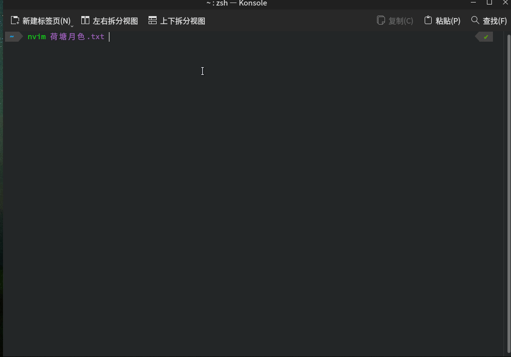

# 说明

使用 jieba 对中文进行分词，增强了 vim 的 e,b 功能

# 预览



# 构建

构建依赖为 lua-devel (fedora)、git、cmake、c++ 17

1. git clone --depth=1 --recusive https://github.com:cathaysia/jieba_nvim.git
2. cd jieba_nvim
3. cmake -B build -DCMAKE_BUID_TYPE=Release
4. cmake --build build
5. cmake --install build --prefix=${HOME}

> 注意！ --prefix=${HOME} 是必须的！！！

> 默认安装路径为 ${HOME}/.config/nvim/lua/。当然，你也可以手动将 build/libjiebamove.so 和
> build/libjiebamove/data 拷贝到任意 lua 可以识别的路径，唯一的要求是 data 目录必须要荷
> libjiebamove.so 位于同于路径

在 init.lua 中附加以下内容：

```lua
local jieba = require("libjiebamove")

function _G.move_chs(isRight)
    local row = vim.api.nvim_win_get_cursor(0)[1]
    local col = vim.api.nvim_win_get_cursor(0)[2]
    local content = vim.api.nvim_buf_get_lines(0,row-1,row,0)[1]
    local new_pos = jieba.getPos(content, col, isRight)
    print(new_pos)
    vim.api.nvim_win_set_cursor(0,{row,new_pos})
end


vim.api.nvim_set_keymap("n","e", ":lua move_chs(1)<CR>", {})
vim.api.nvim_set_keymap("n","b", ":lua move_chs(0)<CR>", {})
```


